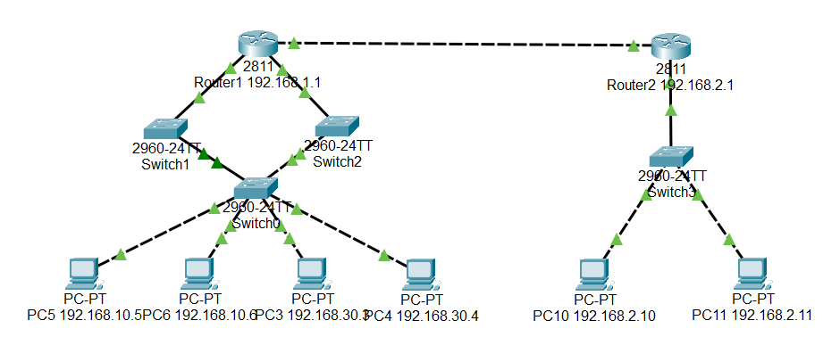

# 🔐 Network Documentation M145 Project


## 🌐 Topology Overview

- **Router1**
  - Subinterfaces:
    - VLAN 10 → 192.168.10.1/24
    - VLAN 30 → 192.168.30.1/24
  - VPN to Router2 over 10.0.0.0/30
  - IPsec + ISAKMP used for VPN encryption

- **Router2**
  - VLAN: 192.168.2.0/24
  - VPN to Router1 over 10.0.0.0/30

- **Switches**
  - Switch1 → root bridge (STP), connects to Router1, Switch0
  - Switch2 → connects to Router1, Switch0
  - Switch0 → core switch with PC3, PC4, PC5, PC6

- **PCs**
  - PC3, PC4 → VLAN10 → 192.168.10.x
  - PC5, PC6 → VLAN30 → 192.168.30.x
  - PC10, PC11 → VLAN20 → 192.168.2.x

## ✅ VLAN Verification Commands

On **Switch1, Switch2, Switch0**:
```
show vlan brief
```

Check trunk links:
```
show interfaces trunk
```

Check STP configuration:
```
show spanning-tree vlan 10
show spanning-tree vlan 30
show spanning-tree vlan 20
```

## ✅ VPN Verification Commands

On **Router1 and Router2**:
```
show crypto isakmp sa
show crypto ipsec sa
```

## ✅ Important Ping Tests

| Source       → Destination            | Example Command                    |
|--------------------------------------|-----------------------------------|
| PC3 → PC4 (same VLAN)              | ping 192.168.30.4                 |
| PC5 → PC6 (same VLAN)              | ping 192.168.10.6                 |
| PC3 → PC5 (inter-VLAN)             | ping 192.168.10.5                 |
| PC3 → Router2 (VPN)                | ping 10.0.0.2                     |
| PC3 → Router2 LAN (behind VPN)    | ping 192.168.2.1                  |
| Router1 → PC10              | ping 192.168.2.10                  |

## ✅ SNMP Query Example

Go to desktop mib browser and check properties of other devices

## ✅ Final Checklist

- ✅ Trunk ports allow VLAN 10 and VLAN 30.
- ✅ Switch1 has STP root priority (`priority 4096`), Switch2/Switch0 use higher priority (`8192`).
- ✅ Static routes:
    - Router1 → `ip route 192.168.2.0 255.255.255.0 10.0.0.2`
    - Router2 → 
        - `ip route 192.168.10.0 255.255.255.0 10.0.0.1`
        - `ip route 192.168.30.0 255.255.255.0 10.0.0.1`
- ✅ VPN ACLs or crypto maps cover both VLAN10 and VLAN30 subnets.
- ✅ PCs use the correct gateway:
    - VLAN10 → 192.168.10.1
    - VLAN30 → 192.168.30.1

## 🚀 Summary Commands

```
show vlan brief
show interfaces trunk
show spanning-tree vlan 10
show spanning-tree vlan 30
show crypto isakmp sa
show crypto ipsec sa
ping <destination>
```


## Keys
vpn key: ´´´123456´´´
snmp string: ´´´public´´´
